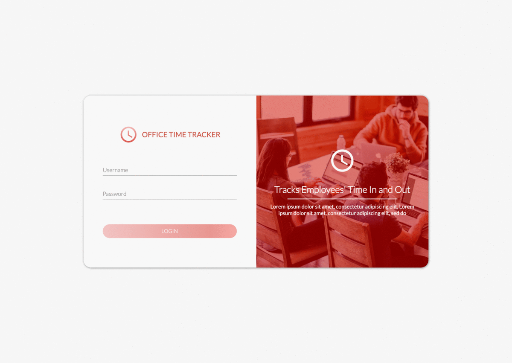

# Office Time Tracker
> An Angular 7 and Node Express with KnexJS and PostgreSQL application that tracks employee's time-in and time-out

#### Back End Tools used:
`Express` `NodeJS` `Typescript` `Babel` `Nodemon` `KnexJS` `PostgreSQL` `Bcrypt` `JWT` `Express JWT` 

#### Front End Tools used:
`Angular 7` `Angular CLI` `Angular Material` `Flexbox` `Typescript` `ES5` `Ngx-Formly` `JWT-Decode` `Rxjs` `MomentJS`

#### How to run

##### 1.) Install dependencies
Installs both front end and backend dependencies

`$ npm run install:all`        

##### 2.) Edit `.env` file (DEV_DB_*) based on your local postgresql configuration 

##### 3.) Run Knex Migration Scripts

`$ npm run knex:latest` 

or  `$ npm run knex:rollback` if you want to undo the migration

##### 4.) Run the application

`$ npm start` to run both node and angular 

or if you want to run it separately: `npm run ng:start` and `npm run express:start`

